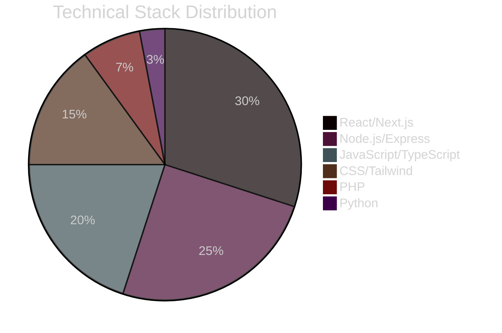

<div align="center">
  
#  **Welcome to Masoud Amini's Digital Universe**


[](https://visitcount.itsvg.in)

</div>


##  **About Me**


```javascript
const masoudAmini = {
    location: "Dubai, UAE 🌆",
    languages: {
        spoken: ["Persian (Native)", "English (Fluent)", "Arabic (Basic)"],
        programming: ["JavaScript", "TypeScript", "PHP", "Python"]
    },
    currentRole: "Full Stack Web Developer",
    passions: [
        "Building scalable web applications",
        "Creating intuitive user experiences",
        "Solving complex problems with elegant solutions",
        "Continuous learning and growth"
    ],
    philosophy: "Code is poetry in motion - every function tells a story"
};
```

### 🎯 **Professional Summary**

> **Bilingual Full Stack Developer** fluent in **Persian** and **English**, crafting digital experiences from the heart of Dubai's tech ecosystem. I bridge cultures and technologies, bringing a unique perspective to every project through my multilingual capabilities and diverse technical expertise.

<br clear="right"/>


##  **Technical Expertise**

<div align="center">

### 🚀 **Frontend Mastery**
<p align="center">
  
  
  
  
</p>

### 🎨 **UI/UX & Styling**
<p align="center">
  
  
  
  
  
</p>

### ⚙️ **Backend & Server**
<p align="center">
  
  
  
  
</p>

### 🗄️ **Database & Tools**
<p align="center">
  
  
  
  
</p>

### 🛠️ **DevOps & Tools**
<p align="center">
  
  
  
  
  
</p>

</div>


## 📊 **Skill Proficiency Breakdown**

<div align="center">



</div>

### 💪 **Core Competencies**

<table align="center">
<tr>
<td width="50%">

#### **Expert Level** ⭐⭐⭐⭐⭐
- React.js & Next.js Development
- Node.js Backend Architecture
- JavaScript ES6+ & TypeScript
- Responsive Design with Tailwind CSS
- RESTful API Design & Integration
- Modern HTML5 & CSS3

</td>
<td width="50%">

#### **Professional Level** ⭐⭐⭐⭐
- PHP Development
- Database Design (SQL/NoSQL)
- Version Control with Git
- Agile Development Methodologies
- Cross-browser Compatibility
- Performance Optimization

</td>
</tr>
<tr>
<td width="50%">

#### **Growing Expertise** ⭐⭐⭐
- Python Programming
- Docker Containerization
- CI/CD Pipelines
- Cloud Services (AWS/Azure)
- GraphQL APIs
- Testing Frameworks

</td>
<td width="50%">

#### **Soft Skills** 💡
- **Bilingual Communication** (Persian/English)
- Problem-Solving & Critical Thinking
- Team Collaboration
- Project Management
- Client Communication
- Continuous Learning Mindset

</td>
</tr>
</table>


## 🌟 **What Sets Me Apart**

<div align="center">

### 🌐 **Multilingual Advantage**


> **Bridging cultures through code** - My bilingual fluency in **Persian** and **English** enables seamless collaboration with diverse international teams and clients, bringing unique cultural perspectives to technical solutions.

</div>

### 🎯 **Professional Approach**

```typescript
interface DeveloperMindset {
  approach: "Solution-Oriented" | "User-Centric" | "Performance-First";
  methodology: "Agile" | "Test-Driven" | "Component-Based";
  values: ["Clean Code", "Scalability", "Innovation", "Collaboration"];
  commitment: "Delivering Excellence in Every Line of Code";
}
```


## 📈 **GitHub Analytics & Activity**

<div align="center">
  
 


</div>


## 🚀 **Current Focus & Future Goals**

<div align="center">

### 📚 **Currently Learning**
- Advanced TypeScript Patterns & Best Practices
- Microservices Architecture with Node.js
- Web3 & Blockchain Development
- AI/ML Integration in Web Applications
- Advanced Python for Automation

### 🎯 **2025 Objectives**
- Master Full-Stack TypeScript Development
- Contribute to Major Open Source Projects
- Build SaaS Applications with Global Impact
- Obtain Cloud Architecture Certifications
- Expand into Mobile Development with React Native

</div>


## 🤝 **Let's Connect & Collaborate**

<div align="center">

### 💼 **Open for Opportunities**

I'm actively seeking collaborations in:
- **Enterprise Web Applications**
- **E-commerce Platforms**
- **SaaS Products**
- **Progressive Web Apps**
- **API Development & Integration**
- **International Projects** (Leveraging my bilingual capabilities)

<p align="center">
  <a href="https://linkedin.com/in/masoudamini"></a>
  <a href="https://twitter.com/masoudamini"></a>
  <a href="mailto:masoud.amini@email.com"></a>
  <a href="https://masoudamini.dev"></a>
</p>

### 📬 **Get In Touch**
> Whether you need a **bilingual developer** for international projects, want to discuss **innovative web solutions**, or simply want to connect over shared interests in technology, I'm always open to meaningful conversations.

</div>


## 💭 **Developer Philosophy**

<div align="center">

### ✨ **Closing Thoughts**

> *"In the intersection of Persian elegance and modern technology, I craft digital experiences that transcend borders and languages. Every project is a bridge between cultures, every line of code a step toward global connectivity."*


### 🙏 **Thank You for Visiting**


**Let's build something extraordinary together** 🚀

</div>
